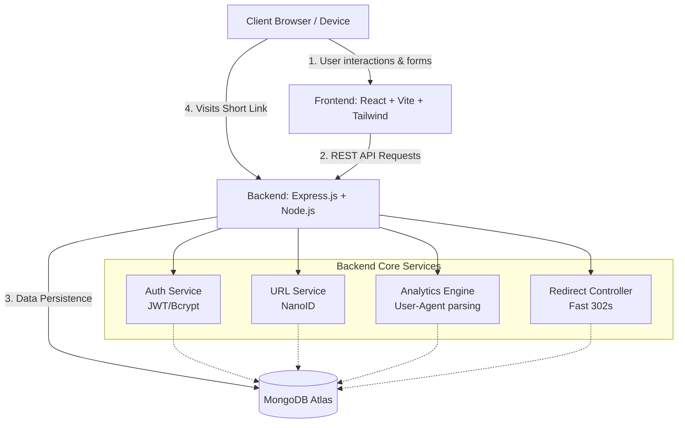

# Linklytics - URL Shortener & Analytics Platform

A full-stack URL shortener application built with the MERN stack (MongoDB, Express, React, Node.js) featuring real-time click analytics, geographic tracking, and QR code generation.

---

## 🎥 Application Demonstration Video

**▶️ Watch the Video Explanation Here: [ ("https://www.loom.com/share/42bd7be67d2048babd55271e2818635c") ]**
*(A detailed walkthrough explaining the features, codebase, and architecture of the application.)*

---

## 🏗️ Architecture Diagram

Below is the high-level architecture of the Linklytics platform, detailing the flow of data between the client, the React frontend, the Node.js backend services, and the MongoDB database.



---

## 📝 AI Planning Document & Documentation

The entire development of this project was systematically planned and documented. You can find the complete architectural and structural breakdowns in the following documents:

- **[IMPLEMENTATION.md](./IMPLEMENTATION.md)**: Contains the comprehensive, step-by-step master implementation plan detailing the setup, backend endpoints, frontend components, and deployment strategies.
- **[DOCUMENTATION.md](./DOCUMENTATION.md)**: Contains the full file-by-file reference guide, database schema structures, and dependency definitions for the MERN stack.

---

## ⚙️ Setup Instructions

### Prerequisites
- Node.js (v18.x or higher)
- MongoDB (Local instance or MongoDB Atlas cluster URI)
- Git

### 1. Installation
Clone the repository and install all dependencies for both the frontend and backend using the root setup command:
```bash
# Install dependencies for both frontend and backend
npm install
```

### 2. Environment Variables
Create a `.env` file inside the `backend/` directory with the following variables:
```env
PORT=5000
MONGODB_URI=mongodb://127.0.0.1:27017/linklytics
JWT_SECRET=your_super_secret_jwt_key
BASE_URL=http://localhost:5000
FRONTEND_URL=http://localhost:5173
```

*(Note: For the frontend, a `.env` file is also required inside the `frontend/` folder containing `VITE_API_BASE_URL=http://localhost:5000`)*

### 3. Running the Application locally
From the root directory, run the concurrent development script to start both servers simultaneously:
```bash
npm run dev
```
- The **Frontend** will be running at: `http://localhost:5173`
- The **Backend API** will be running at: `http://localhost:5000`

---

## 🧠 Assumptions Made

- **Traffic Scale:** The app assumes that the `nanoid` 6-character short code generator will not encounter massive collision rates under standard hackathon testing loads. Collision retry logic handles edge cases.
- **Local Analytics Fallback:** Geolocation and IP tracking uses mock fallbacks for local environments (`localhost` / `127.0.0.1`) to ensure the analytics dashboard populates beautifully during local presentations without needing a public IP.
- **Client Capabilities:** Clients visiting the short link have standard browsers. While the 302 redirect happens entirely server-side, the frontend dashboard requires Javascript to render the analytical charts (Recharts).
- **Environment:** The `npm run dev` script assumes you are running the project from the root folder containing both `frontend` and `backend` directories.

---

*This project is a part of a hackathon run by https://katomaran.com*
